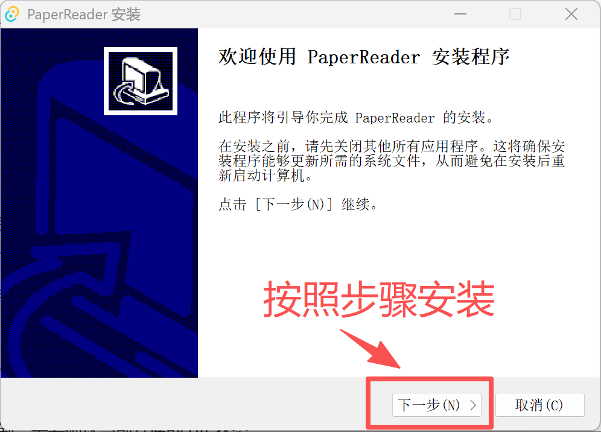
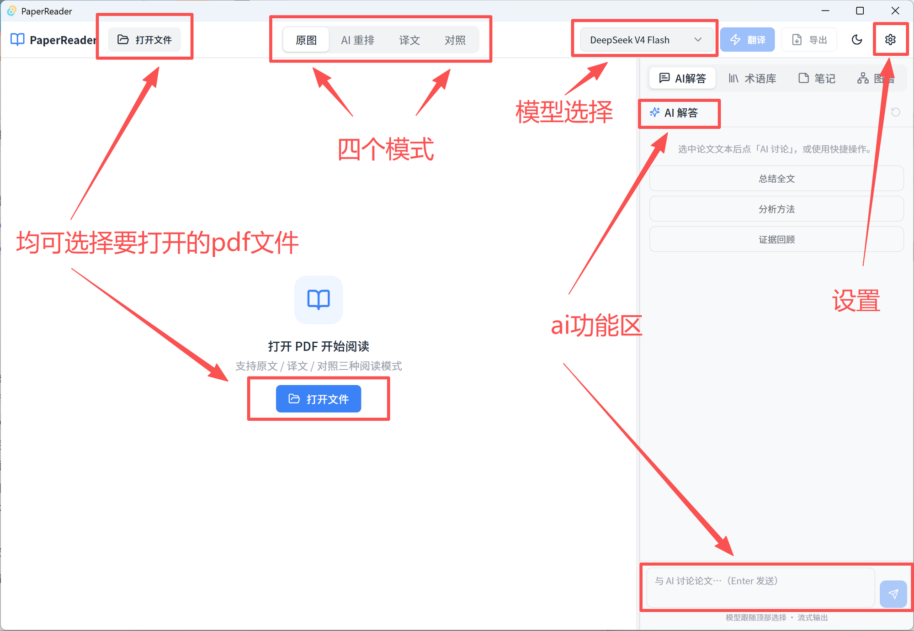
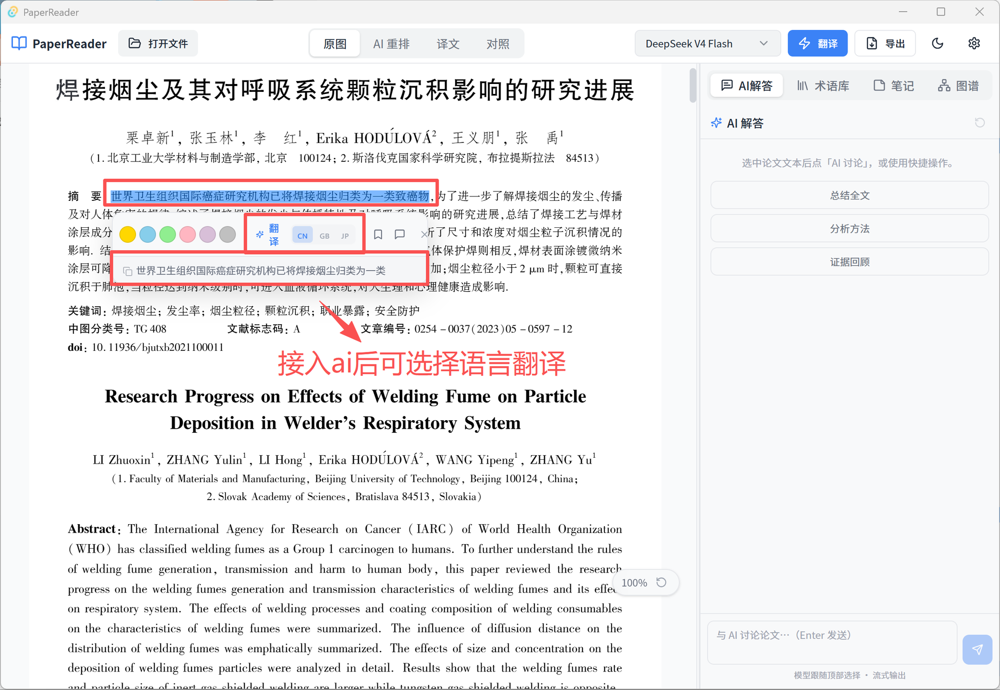

<div align="center">
  <!-- Logo 将在后续版本添加 -->
  <h1>PaperReader</h1>
  <p>
    <b>中英双语的智能学术论文阅读与翻译工具</b><br/>
    <b>An intelligent bilingual academic paper reader & translator</b>
  </p>
  <p>
    <a href="https://github.com/BofanZhou/PaperReader/releases">Download</a> ·
    <a href="#installation">安装</a> ·
    <a href="#usage">使用</a> ·
    <a href="#roadmap">Roadmap</a> ·
    <a href="#building-from-source">源码构建</a>
  </p>
</div>

---

## 目录 / Table of Contents

- [中文](#中文)
  - [设计初衷](#设计初衷)
  - [当前功能](#当前功能-v010)
  - [路线图](#路线图)
  - [安装方式](#安装方式)
  - [使用说明](#使用说明)
  - [API Key 与费用](#api-key-与费用)
  - [已知问题与局限性](#已知问题与局限性)
  - [源码构建](#源码构建)
  - [致谢](#致谢)
  - [开源协议](#开源协议)
- [English](#english)
  - [Why PaperReader?](#why-paperreader)
  - [Current Features](#current-features-v010)
  - [Roadmap](#roadmap-1)
  - [Installation](#installation)
  - [Usage](#usage)
  - [API Key & Cost](#api-key--cost)
  - [Known Issues & Limitations](#known-issues--limitations)
  - [Building from Source](#building-from-source)
  - [Acknowledgments](#acknowledgments)
  - [License](#license)

---

# 中文

## 设计初衷

PaperReader 的诞生很简单：**我不想再给论文阅读器充会员了。**

市面上很多学术 PDF 阅读工具采用订阅制，但我的需求其实很单纯：打开一篇英文论文，得到流畅的中文阅读体验，同时保留原文对照和笔记能力。与其每年为各类高昂的软件付费，不如做一个按量计费本地的开源阅读器。

PaperReader 面向所有需要**精读英语学术论文**的用户，尤其是科研人员、研究生和工程师。它把论文解析、AI 翻译、结构化阅读、高亮笔记和 AI 对话整合在一个桌面应用里，翻译成本按实际 API 调用量计算，没有会员订阅，完全开源。

---

## 当前功能 (v0.1.0)

> ✅ = 已落地 &nbsp;&nbsp; 🚧 = 基础可用但仍在优化

### 论文解析与阅读
- ✅ 一键导入 PDF，自动调用 **OpenDataLoader PDF** 解析结构化文本、标题层级、图片与表格
- ✅ **四种阅读视图**：原图 / ai重排 / 译文 / 对照
- ✅ **AI 智能重排视图**：将解析后的碎片文本重新组织成结构清晰的结构化文本，适合快速通读
- ✅ 保留论文中的图片、表格、公式，支持 Ctrl + 滚轮缩放
- ✅ 选中文本即弹出浮动工具栏：翻译、高亮、添加笔记、AI 讨论问答

### AI 翻译
- ✅ 支持 **DeepSeek V4 Flash / Pro** 与 **Kimi K3 / Kimi for Coding**
- ✅ 整篇翻译或分段翻译，按模型上下文自动决策
- ✅ 翻译结果文件缓存，重复打开不重复扣费
- ✅ DeepSeek 前缀缓存优化，降低翻译成本

### AI 聊天侧边栏
- ✅ 选中论文任意段落后点击「AI 讨论」，自动注入上下文
- ✅ 支持「总结全文」「分析方法」「证据回顾」等快捷指令
- ✅ 流式输出，支持停止生成

### 设置与数据管理
- ✅ 设置面板：API Key、默认模型、主题、字号、行距、双语分栏比例
- ✅ 论文列表管理、缓存清理、数据备份/导入导出
- ✅ API Key 使用系统 keyring 加密存储，不写入配置文件

### 导出
- 🚧 翻译 PDF 导出（已实现基础版本，复杂排版持续优化中）

---

## 路线图

> 以下功能将在后续版本陆续加入：

| 功能 | 状态 |
|------|------|
| 句子级中英对照联动高亮 | 规划中 |
| 完整高亮笔记系统（6 种分类 + 双向导航） | 规划中 |
| 术语提取与术语库面板 | 规划中 |
| WikiLink 双向链接与知识图谱（Obsidian 风格） | 规划中 |
| 本地语义检索（Embedding + sqlite-vec） | 规划中 |
| 扫描版 / 复杂表格 PDF 的混合 OCR 模式 | 适配中 |
| 超大 PDF（>500 页）虚拟滚动与批量解析 | 适配中 |
| 自动更新与轻量在线安装包 | 规划中 |
| 图标与 Logo | 后续版本添加 |

---

## 安装方式

前往 [GitHub Releases](https://github.com/BofanZhou/PaperReader/releases) 下载对应安装包。

### 完整离线版（当前发布）

- 文件名：`PaperReader_0.1.0_x64-setup.exe`
- 大小：约 235 MB
- 特点：内置完整 WebView2 运行时，**无需联网安装依赖**，首次安装后即可离线使用
- 适用：网络环境不稳定、需要一键安装的用户

### 轻量在线版（未来计划）

- 预计大小：约 15–25 MB
- 特点：首次启动时按需下载 Java / Python / OpenDataLoader 环境（约 165 MB），体积更小
- 适用：网络良好、希望安装包更小的用户
- 状态：尚未发布，将作为后续版本提供

> 系统要求：Windows 10 1803+ 或 Windows 11，64 位系统。

<!-- TODO: 添加安装截图 -->


---

## 使用说明

1. **安装并启动**  
   运行安装包，首次启动会检测 Java / Python / OpenDataLoader 环境。缺失项可点击「一键安装」自动下载。

2. **导入论文**  
   点击顶部工具栏「打开文件」选择 PDF，应用会自动解析并生成结构化内容。

3. **切换阅读模式**  
   顶部工具栏提供「原文」「译文」「对照」「AI 重排」四种视图。

4. **选中翻译 / 讨论**  
   用鼠标选中文本，浮动工具栏会弹出「翻译」「高亮」「笔记」「AI 讨论」等操作。

5. **AI 侧边栏**  
   右侧标签切换到「AI 解答」，可直接与当前论文对话，或点击快捷指令让 AI 总结全文、分析方法。

<!-- TODO: 添加主界面、选中翻译截图 -->



---

## API Key 与费用

PaperReader **按量计费**，没有订阅会员。你需要自备以下任一平台的 API Key：

- **DeepSeek**（推荐默认）：`https://platform.deepseek.com`
- **Kimi 开放平台**：`https://platform.moonshot.cn`
- **Kimi for Coding**（kimi code套餐订阅独立入口，与开放平台 Key 不通用）

在设置面板填入 Key 后，应用会自动存储到系统 keyring 中，不会写入任何文本文件或提交到 Git。

### 费用参考

以一篇 10 页、约 15,000 个 token 的英文论文为例：

- **DeepSeek V4 Flash**：整篇翻译约 **¥0.05**（含前缀缓存命中后更便宜）
- 实际费用取决于论文长度、模型选择和翻译输出长度，可在翻译前查看预估费用。

> 不填写 API Key 也能打开和解析 PDF，但翻译和 AI 讨论功能不可用。

---

## 已知问题与局限性

v0.1.0 是首版，以下问题已知并正在优化：

- **原图视图**：原图选中区域与原图实际文字区域可能存在偏移，后续会优化文本层对齐。
- **图表位置**：图片/表格位置基于解析结果推断，不能保证完全正确；表格目前采用原图裁剪，复杂表格识别率有限。
- **AI 翻译**：翻译效果取决于模型和论文领域，不能保证完美，建议重要论文仍需人工核对。
- **大 PDF / 扫描版**：正在适配中，超大文件或扫描版 PDF 可能解析较慢或效果不佳。
- **导出 PDF**：基础版本已可用，复杂排版和字体子集化仍在优化。
- **API Key 自备**：这是为了把成本降到最低，避免通过会员费转嫁给你。

---

## 源码构建

需要安装：

- [Node.js](https://nodejs.org/) 18+（推荐 22）
- [Rust](https://www.rust-lang.org/) 1.70+
- Windows 10/11 64 位

```bash
# 1. 克隆仓库
git clone https://github.com/BofanZhou/PaperReader.git
cd PaperReader

# 2. 安装前端依赖
npm install --legacy-peer-deps

# 3. 开发模式
npm run tauri dev

# 4. 生产构建（生成安装包）
npm run tauri build -- --bundles nsis
```

构建产物位于 `src-tauri/target/release/bundle/nsis/`。

---

## 致谢

PaperReader 在交互设计上参考了：

- [PaperMind](https://papermind.io/) 的选中即翻译、浮动工具栏与 AI 聊天思路
- [Obsidian](https://obsidian.md/) 的双向链接与知识图谱理念

底层论文解析引擎使用：

- [OpenDataLoader PDF](https://github.com/opendataloader-project/opendataloader-pdf)

界面框架基于：

- [Tauri 2](https://v2.tauri.app/) + [React 18](https://react.dev/) + [Tailwind CSS](https://tailwindcss.com/)

---

## 开源协议

[MIT License](LICENSE) © 2026 Bofan Zhou

---

# English

## Why PaperReader?

PaperReader was born out of a simple frustration: **I was tired of paying subscriptions for academic PDF readers.**

Many paper-reading tools charge a yearly membership for features I don't always need. My actual need is simple: open an English paper, read it smoothly in Chinese, and keep the original text side-by-side for reference. Instead of locking users into subscriptions, PaperReader is **pay-as-you-go**: you only pay for the AI translation API calls you actually use, and your data stays local.

PaperReader is built for anyone who needs to **read English academic papers carefully**—researchers, graduate students, and engineers. It combines PDF parsing, AI translation, structured reading, highlighting, note-taking, and AI chat in one desktop app.

---

## Current Features (v0.1.0)

> ✅ = Shipped &nbsp;&nbsp; 🚧 = Basic but still improving

### Parsing & Reading
- ✅ One-click PDF import; structured text, headings, figures, and tables extracted via **OpenDataLoader PDF**
- ✅ Three reading modes: **Original / Translated / Bilingual**
- ✅ **AI Restructured View**: reorganizes parsed fragments into clean Markdown for quick reading
- ✅ Preserves figures, tables, and formulas; supports Ctrl + scroll to zoom
- ✅ Select any text to open a floating toolbar: translate, highlight, take notes, or start an AI discussion

### AI Translation
- ✅ Supports **DeepSeek V4 Flash / Pro** and **Kimi K3 / Kimi for Coding**
- ✅ Whole-paper or chunked translation, chosen automatically based on model context limits
- ✅ Translation results are cached locally so you are not charged twice for the same paper
- ✅ DeepSeek prefix-cache optimization to lower translation costs

### AI Chat Sidebar
- ✅ Select any text and click "AI Discuss" to inject it into the chat context
- ✅ Quick actions: Summarize Full Text, Analyze Method, Evidence Review
- ✅ Streaming output with stop-generation support

### Settings & Data Management
- ✅ Settings panel: API keys, default model, theme, font size, line height, bilingual split ratio
- ✅ Paper list management, cache cleanup, data backup/import/export
- ✅ API keys are stored in the OS keyring, never in plain-text config files

### Export
- 🚧 Translated PDF export (basic version shipped; complex layouts are still being refined)

---

## Roadmap

| Feature | Status |
|--------|--------|
| Sentence-level bilingual linked highlighting | Planned |
| Full highlighting & note system (6 categories + bidirectional navigation) | Planned |
| Term extraction & term panel | Planned |
| WikiLink bidirectional links & knowledge graph (Obsidian-style) | Planned |
| Local semantic search (Embedding + sqlite-vec) | Planned |
| Hybrid OCR mode for scanned / complex-table PDFs | In progress |
| Virtual scrolling & batch parsing for large PDFs (>500 pages) | In progress |
| Auto-updater & lightweight online installer | Planned |
| App icon & logo | Added in a future release |

---

## Installation

Download from [GitHub Releases](https://github.com/BofanZhou/PaperReader/releases).

### Full Offline Installer (current release)

- File: `PaperReader_0.1.0_x64-setup.exe`
- Size: ~235 MB
- Includes the full WebView2 runtime; **works offline after installation** with no extra dependency downloads
- Best for: users with unstable networks or who want a single-click install

### Lightweight Online Installer (planned)

- Estimated size: ~15–25 MB
- Downloads Java / Python / OpenDataLoader on first launch (~165 MB) as needed
- Best for: users with good internet who prefer a smaller installer
- Status: Not yet released; coming in a future version

> System requirements: Windows 10 1803+ or Windows 11, 64-bit.

<!-- TODO: Add install screenshot -->


---

## Usage

1. **Install and launch**  
   Run the installer. On first launch the app checks for Java / Python / OpenDataLoader. Missing components can be installed automatically with one click.

2. **Import a paper**  
   Click "Open File" in the toolbar and select a PDF. The app parses it and generates structured content.

3. **Switch reading modes**  
   The toolbar offers Original, Translated, Bilingual, and AI Restructured views.

4. **Translate or discuss selections**  
   Select text with your mouse; a floating toolbar appears with Translate, Highlight, Note, and AI Discuss.

5. **AI sidebar**  
   Switch the right sidebar to "AI Answer" to chat about the paper or use quick actions like Summarize Full Text.

<!-- TODO: Add main UI and selection translation screenshots -->


---

## API Key & Cost

PaperReader is **pay-as-you-go**, not a subscription. You need to bring your own API key from one of the following providers:

- **DeepSeek** (recommended default): `https://platform.deepseek.com`
- **Kimi Open Platform**: `https://platform.moonshot.cn`
- **Kimi for Coding** (separate account; keys are not interchangeable with the Open Platform)

Keys are stored in your OS keyring after you enter them in the settings panel; they are never written to plain text files or committed to Git.

### Cost estimate

For a 10-page paper of about 15,000 tokens:

- **DeepSeek V4 Flash**: roughly **¥0.05** per full-paper translation (even cheaper with prefix-cache hits)
- Actual cost depends on paper length, model choice, and translation output length. The app shows an estimated cost before translating.

> You can open and parse PDFs without an API key, but translation and AI chat require one.

---

## Known Issues & Limitations

v0.1.0 is the first release. The following issues are known and being worked on:

- **Original-view text selection**: selected text regions may not perfectly align with the underlying PDF text layer; alignment will be improved.
- **Figure/table placement**: positions are inferred from parsing results and may not be perfect. Tables are currently cropped from the original page image, which can fail for complex tables.
- **AI translation quality**: depends on the model and domain; important papers should still be human-checked.
- **Large / scanned PDFs**: still being adapted; very large files or scanned PDFs may parse slowly or with reduced quality.
- **PDF export**: a basic version is available; complex layout and font subsetting are still being refined.
- **Bring-your-own API key**: this is intentional to keep costs as low as possible and avoid subscription fees.

---

## Building from Source

Requirements:

- [Node.js](https://nodejs.org/) 18+ (recommended 22)
- [Rust](https://www.rust-lang.org/) 1.70+
- Windows 10/11 64-bit

```bash
# 1. Clone the repo
git clone https://github.com/BofanZhou/PaperReader.git
cd PaperReader

# 2. Install frontend dependencies
npm install --legacy-peer-deps

# 3. Development mode
npm run tauri dev

# 4. Production build (creates installer)
npm run tauri build -- --bundles nsis
```

Build artifacts are located at `src-tauri/target/release/bundle/nsis/`.

---

## Acknowledgments

PaperReader's interaction design draws inspiration from:

- [PaperMind](https://papermind.io/) for the select-to-translate floating toolbar and AI chat ideas
- [Obsidian](https://obsidian.md/) for the bidirectional linking and knowledge graph concepts

PDF parsing is powered by:

- [OpenDataLoader PDF](https://github.com/opendataloader-project/opendataloader-pdf)

The UI is built on:

- [Tauri 2](https://v2.tauri.app/) + [React 18](https://react.dev/) + [Tailwind CSS](https://tailwindcss.com/)

---

## License

[MIT License](LICENSE) © 2026 Bofan Zhou
